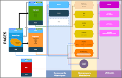

# P11: React & ReactRouter / Kasa website

 - Flowchart
 - SlideShow

## Project's presentation

Kasa has been in the business of renting apartments between individuals for almost 10 years now. With more than 500 ads posted every day, Kasa is one of the leaders in private apartment rentals in France.

The Kasa site was coded more than 10 years ago in ASP.NET with significant legacy code, and we are asked to build a new version with **React & React-Router**.

## Routing - v6

**BrowerRouter** use with basename parameter. **Routes / Route** components designed to serve proper URL & **Error 404** page manages wrong routes instantly.

## Asynchronous

API calls simulation, **loader spinner** implemented to manage loading images, **components optimisation** for reusability.

## UI/UX

Vanilla javascript **Carousel** self-implemented with infinite loop capabilities.

## Branches

* **main**: Development files [./src](./src/).
Specific dedicated **router file** : [./src/app/router.jsx](./src/app/router.jsx)
* **gh-pages**: **Production files** displaying the website.

The application should not throw an error. However, the setting of the GitHub Pages server means that the URL is evaluated on the server side, which triggers an error when reloading the housing page (the housing id entered in parameter being dynamic). A deployment trick allows us to work around this problem ( cloning of *index.html* into *404.html* ).

Despite this erroneous alert, the application works correctly and a production release on a professional server on which the technical team will have control will no longer produce this error.

More informations here : [https://stackoverflow.com/questions/46056414/getting-404-for-links-with-create-react-app-deployed-to-github-pages](https://stackoverflow.com/questions/46056414/getting-404-for-links-with-create-react-app-deployed-to-github-pages)

# Getting Started with Create React App

This project was bootstrapped with [Create React App](https://github.com/facebook/create-react-app).

## Available Scripts

In the project directory, you can run:

### `npm start`

Runs the app in the development mode.\
Open [http://localhost:3000](http://localhost:3000) to view it in your browser.

The page will reload when you make changes.\
You may also see any lint errors in the console.

### `npm test`

Launches the test runner in the interactive watch mode.\
See the section about [running tests](https://facebook.github.io/create-react-app/docs/running-tests) for more information.

### `npm run build`

Builds the app for production to the `build` folder.\
It correctly bundles React in production mode and optimizes the build for the best performance.

The build is minified and the filenames include the hashes.\
Your app is ready to be deployed!

See the section about [deployment](https://facebook.github.io/create-react-app/docs/deployment) for more information.

### `npm run eject`

**Note: this is a one-way operation. Once you `eject`, you can't go back!**

If you aren't satisfied with the build tool and configuration choices, you can `eject` at any time. This command will remove the single build dependency from your project.

Instead, it will copy all the configuration files and the transitive dependencies (webpack, Babel, ESLint, etc) right into your project so you have full control over them. All of the commands except `eject` will still work, but they will point to the copied scripts so you can tweak them. At this point you're on your own.

You don't have to ever use `eject`. The curated feature set is suitable for small and middle deployments, and you shouldn't feel obligated to use this feature. However we understand that this tool wouldn't be useful if you couldn't customize it when you are ready for it.

## Learn More

You can learn more in the [Create React App documentation](https://facebook.github.io/create-react-app/docs/getting-started).

To learn React, check out the [React documentation](https://reactjs.org/).

### Code Splitting

This section has moved here: [https://facebook.github.io/create-react-app/docs/code-splitting](https://facebook.github.io/create-react-app/docs/code-splitting)

### Analyzing the Bundle Size

This section has moved here: [https://facebook.github.io/create-react-app/docs/analyzing-the-bundle-size](https://facebook.github.io/create-react-app/docs/analyzing-the-bundle-size)

### Making a Progressive Web App

This section has moved here: [https://facebook.github.io/create-react-app/docs/making-a-progressive-web-app](https://facebook.github.io/create-react-app/docs/making-a-progressive-web-app)

### Advanced Configuration

This section has moved here: [https://facebook.github.io/create-react-app/docs/advanced-configuration](https://facebook.github.io/create-react-app/docs/advanced-configuration)

### Deployment

This section has moved here: [https://facebook.github.io/create-react-app/docs/deployment](https://facebook.github.io/create-react-app/docs/deployment)

### `npm run build` fails to minify

This section has moved here: [https://facebook.github.io/create-react-app/docs/troubleshooting#npm-run-build-fails-to-minify](https://facebook.github.io/create-react-app/docs/troubleshooting#npm-run-build-fails-to-minify)
